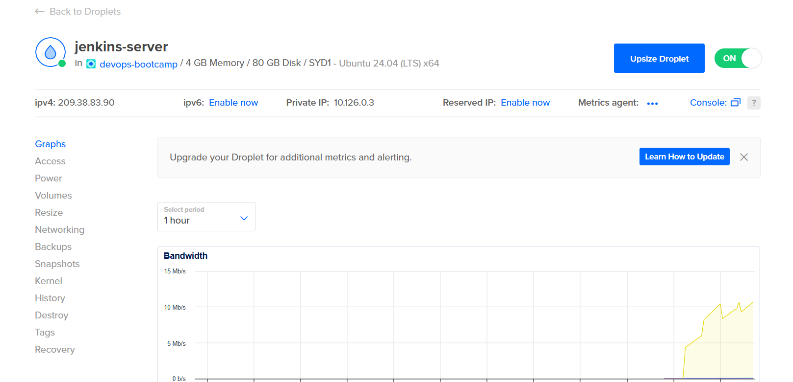
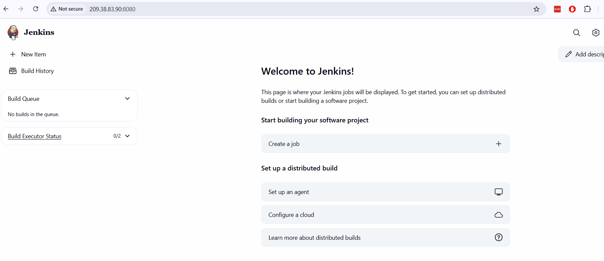
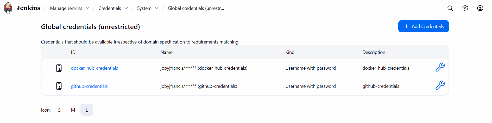
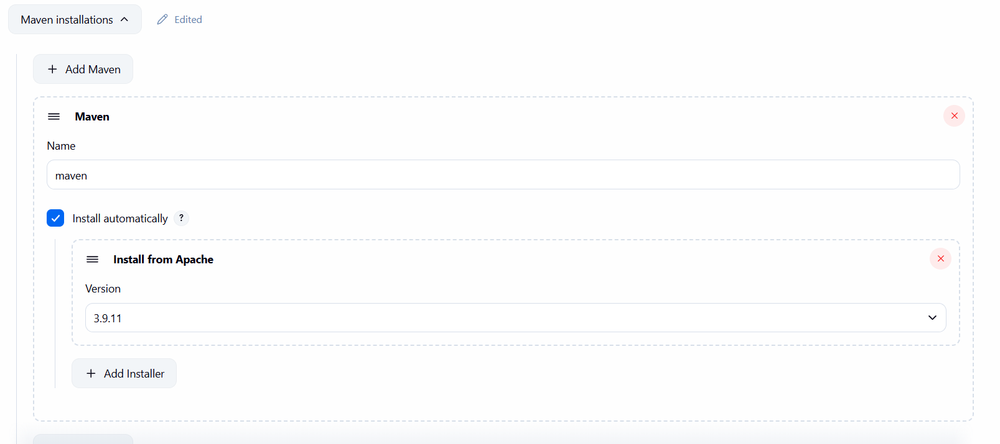
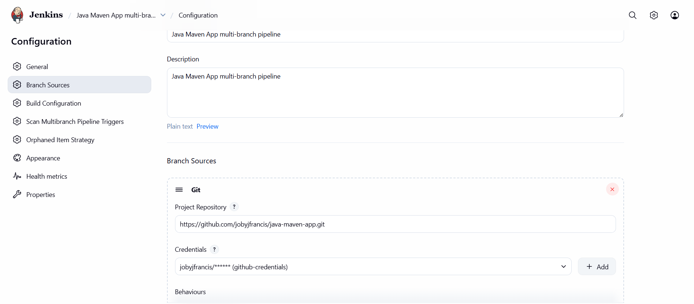
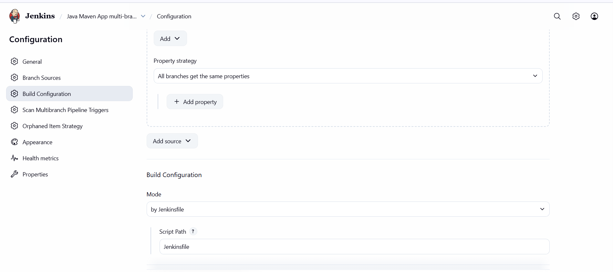
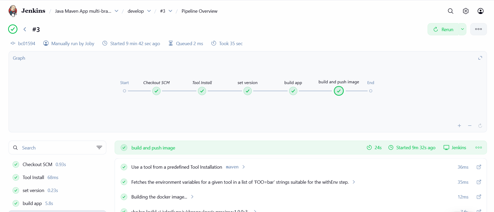

# Project description
Create a CI/CD pipeline for a Java Maven Application to perform the following actions:

* CI: Dynamically set the application version
* CI: Build artifact for Java Maven application - JAR file
* CI: Build and push Docker image to DockerHub
* CD: Deploy new application version to the EKS cluster

# Technologies used
Kubernetes, Jenkins, AWS EKS, Docker Hub, Java, Maven, Linux, Docker, Git, Digital Ocean

# Prerequisite
* Java maven application code available at https://github.com/jobyjfrancis/java-maven-app
* Jenkins shared library https://github.com/jobyjfrancis/jenkins-shared-library

# Steps performed

## Containerise the Java Maven application

1. Created a new branch named `develop` under the Java Maven application repository and configured `Dockerfile` with the appropriate instructions to containerise it - https://github.com/jobyjfrancis/java-maven-app/blob/develop/Dockerfile

2. Tested the application build and docker image creation

```
joby@LAPTOP-KVPR8SO6:~/learn/java-maven-app (develop)$ mvn clean package
[INFO] Scanning for projects...
[INFO]
[INFO] ---------------------< com.example:java-maven-app >---------------------
[INFO] Building java-maven-app 1.0.0
[INFO] --------------------------------[ jar ]---------------------------------
[INFO]
[INFO] --- maven-clean-plugin:2.5:clean (default-clean) @ java-maven-app ---
[INFO]
[INFO] --- maven-resources-plugin:2.6:resources (default-resources) @ java-maven-app ---
[WARNING] Using platform encoding (UTF-8 actually) to copy filtered resources, i.e. build is platform dependent!
[INFO] Copying 1 resource
[INFO]
[INFO] --- maven-compiler-plugin:3.6.0:compile (default-compile) @ java-maven-app ---
[INFO] Changes detected - recompiling the module!
[WARNING] File encoding has not been set, using platform encoding UTF-8, i.e. build is platform dependent!
[INFO] Compiling 1 source file to /home/joby/learn/java-maven-app/target/classes
[INFO]
[INFO] --- maven-resources-plugin:2.6:testResources (default-testResources) @ java-maven-app ---
[WARNING] Using platform encoding (UTF-8 actually) to copy filtered resources, i.e. build is platform dependent!
[INFO] skip non existing resourceDirectory /home/joby/learn/java-maven-app/src/test/resources
[INFO]
[INFO] --- maven-compiler-plugin:3.6.0:testCompile (default-testCompile) @ java-maven-app ---
[INFO] No sources to compile
[INFO]
[INFO] --- maven-surefire-plugin:2.12.4:test (default-test) @ java-maven-app ---
[INFO] No tests to run.
[INFO]
[INFO] --- maven-jar-plugin:2.4:jar (default-jar) @ java-maven-app ---
[INFO] Building jar: /home/joby/learn/java-maven-app/target/java-maven-app-1.0.0.jar
[INFO]
[INFO] --- spring-boot-maven-plugin:2.3.5.RELEASE:repackage (default) @ java-maven-app ---
[INFO] Replacing main artifact with repackaged archive
[INFO] ------------------------------------------------------------------------
[INFO] BUILD SUCCESS
[INFO] ------------------------------------------------------------------------
[INFO] Total time:  2.211 s
[INFO] Finished at: 2025-11-24T18:41:53+13:00
[INFO] ------------------------------------------------------------------------
joby@LAPTOP-KVPR8SO6:~/learn/java-maven-app (develop)$
```
```
joby@LAPTOP-KVPR8SO6:~/learn/java-maven-app (develop)$ ls -al target/*.jar
-rw-r--r-- 1 joby joby 17200345 Nov 24 18:41 target/java-maven-app-1.0.0.jar
joby@LAPTOP-KVPR8SO6:~/learn/java-maven-app (develop)$
```
```
joby@LAPTOP-KVPR8SO6:~/learn/java-maven-app (develop)$ docker build -t jma:1.0.0 .
[+] Building 3.5s (9/9) FINISHED                                                                                                 docker:default
 => [internal] load build definition from Dockerfile                                                                                       0.0s
 => => transferring dockerfile: 187B                                                                                                       0.0s
 => [internal] load metadata for docker.io/library/amazoncorretto:8-alpine3.17-jre                                                         2.8s
 => [auth] library/amazoncorretto:pull token for registry-1.docker.io                                                                      0.0s
 => [internal] load .dockerignore                                                                                                          0.0s
 => => transferring context: 2B                                                                                                            0.0s
 => [internal] load build context                                                                                                          0.0s
 => => transferring context: 81B                                                                                                           0.0s
 => [1/3] FROM docker.io/library/amazoncorretto:8-alpine3.17-jre@sha256:3dbdce03fbe921966033eca64c4f75c949bbe85785ed243e99ed4a335d784bda   0.0s
 => => resolve docker.io/library/amazoncorretto:8-alpine3.17-jre@sha256:3dbdce03fbe921966033eca64c4f75c949bbe85785ed243e99ed4a335d784bda   0.0s
 => CACHED [2/3] COPY ./target/java-maven-app-*.jar /usr/app/                                                                              0.0s
 => CACHED [3/3] WORKDIR /usr/app                                                                                                          0.0s
 => exporting to image                                                                                                                     0.4s
 => => exporting layers                                                                                                                    0.0s
 => => exporting manifest sha256:41d13f94679977c9efe38c867941021d7f0941ac442184f643bcc630c8414796                                          0.0s
 => => exporting config sha256:4d96f2ae3406764290970ef6b142fa5924c30032e620b4cec04f7b41eae1251e                                            0.0s
 => => exporting attestation manifest sha256:10c1071ff2a5474262a6fd2cc147934caa3f9ac1b5baa7cc513c14af7e174f98                              0.0s
 => => exporting manifest list sha256:21dc03bd1ff08f77363056e3276cbfedfa785ceb2af0ff98f4aad8fdfd8f067f                                     0.0s
 => => naming to docker.io/library/jma:1.0.0                                                                                               0.0s
 => => unpacking to docker.io/library/jma:1.0.0                                                                                            0.2s

 1 warning found (use docker --debug to expand):
 - JSONArgsRecommended: JSON arguments recommended for CMD to prevent unintended behavior related to OS signals (line 8)
joby@LAPTOP-KVPR8SO6:~/learn/java-maven-app (develop)$
```
```
joby@LAPTOP-KVPR8SO6:~/learn/java-maven-app (develop)$ docker images | grep jma
jma                                                                      1.0.0           21dc03bd1ff0   13 hours ago    194MB
joby@LAPTOP-KVPR8SO6:~/learn/java-maven-app (develop)$
```
## Continous Integration

This stage involves creating a Jenkins server, configuring the build tools, required credentials and configuring a multi-branch pipeline job

1. Created an Ubuntu 24.04 droplet in Digital Ocean, installed docker and deployed Jenkins as a container in it



```
root@jenkins-server:~# docker version
Client:
 Version:           28.4.0
 API version:       1.51
 Go version:        go1.24.6
 Git commit:        d8eb465
 Built:             Thu Sep 11 16:43:06 2025
 OS/Arch:           linux/amd64
 Context:           default

Server:
 Engine:
  Version:          28.4.0
  API version:      1.51 (minimum version 1.24)
  Go version:       go1.24.6
  Git commit:       249d679
  Built:            Thu Sep 11 16:43:39 2025
  OS/Arch:          linux/amd64
  Experimental:     false
 containerd:
  Version:          v1.7.27
  GitCommit:        05044ec0a9a75232cad458027ca83437aae3f4da
 runc:
  Version:          1.2.6
  GitCommit:
 docker-init:
  Version:          0.19.0
  GitCommit:        de40ad0
root@jenkins-server:~#
```
```
root@jenkins-server:~# docker run -d -p 8080:8080 -v jenkins_home:/var/jenkins_home jenkins/jenkins:lts
Unable to find image 'jenkins/jenkins:lts' locally
lts: Pulling from jenkins/jenkins
13cc39f8244a: Pull complete
dc2a77f462ea: Pull complete
33300af18dd0: Pull complete
c27509c3e53b: Pull complete
e4beac64dffa: Pull complete
a37b858bb47a: Pull complete
744b4792e083: Pull complete
05a7d9a8b608: Pull complete
8d2a75b252b2: Pull complete
65e4ba8066bc: Pull complete
5dc07232677a: Pull complete
7718ff514022: Pull complete
Digest: sha256:7b1c378278279c8688efd6168c25a1c2723a6bd6f0420beb5ccefabee3cc3bb1
Status: Downloaded newer image for jenkins/jenkins:lts
0dc2152277792011d60ed7255febbb956ade7b509b792b067bc741eef8de459a
root@jenkins-server:~#
```
```
root@jenkins-server:~# docker ps
CONTAINER ID   IMAGE                 COMMAND                  CREATED          STATUS          PORTS                                                    NAMES
0dc215227779   jenkins/jenkins:lts   "/usr/bin/tini -- /u…"   47 seconds ago   Up 46 seconds   0.0.0.0:8080->8080/tcp, [::]:8080->8080/tcp, 50000/tcp   determined_hoover
root@jenkins-server:~#
```


2. Added the credentials for Github and Docker Hub so that Jenkins can access them and perform operations such as cloning the code, docker login and docker push image



3. Installed the build tool `maven` for the Java application in Jenkins



4. Stopped the Jenkins container, created it again by mounting `/var/run/docker.sock`, corrected permissions of `var/run/docker.sock` and installed `docker` inside the Jenkins container so that our pipeline can use docker commands

```
root@jenkins-server:~# docker ps
CONTAINER ID   IMAGE                 COMMAND                  CREATED          STATUS          PORTS                                                    NAMES
0dc215227779   jenkins/jenkins:lts   "/usr/bin/tini -- /u…"   39 minutes ago   Up 39 minutes   0.0.0.0:8080->8080/tcp, [::]:8080->8080/tcp, 50000/tcp   determined_hoover
root@jenkins-server:~#
root@jenkins-server:~# docker stop 0dc215227779
0dc215227779
root@jenkins-server:~#
```
```
root@jenkins-server:~# docker run -d -p 8080:8080 -v jenkins_home:/var/jenkins_home -v /var/run/docker.sock:/var/run/docker.sock jenkins/jenkins
:lts
6af93264dcaa56202081fa37a6906ff0d2eac796ac6889f670113d31102e1a39
root@jenkins-server:~#
```
```
root@jenkins-server:~# docker exec -it -u 0 6af93264dcaa /bin/bash
root@6af93264dcaa:/#
root@6af93264dcaa:/# chmod 666  /var/run/docker.sock
root@6af93264dcaa:/#
root@6af93264dcaa:/# curl https://get.docker.com/ > dockerinstall && chmod 777 dockerinstall && ./dockerinstall
  % Total    % Received % Xferd  Average Speed   Time    Time     Time  Current
                                 Dload  Upload   Total   Spent    Left  Speed
100 21013  100 21013    0     0   690k      0 --:--:-- --:--:-- --:--:--  707k
# Executing docker install script, commit: 7d96bd3c5235ab2121bcb855dd7b3f3f37128ed4
+ sh -c apt-get -qq update >/dev/null
+ sh -c DEBIAN_FRONTEND=noninteractive apt-get -y -qq install ca-certificates curl >/dev/null
+ sh -c install -m 0755 -d /etc/apt/keyrings
+ sh -c curl -fsSL "https://download.docker.com/linux/debian/gpg" -o /etc/apt/keyrings/docker.asc
+ sh -c chmod a+r /etc/apt/keyrings/docker.asc
+ sh -c echo "deb [arch=amd64 signed-by=/etc/apt/keyrings/docker.asc] https://download.docker.com/linux/debian trixie stable" > /etc/apt/sources.list.d/docker.list
+ sh -c apt-get -qq update >/dev/null
+ sh -c DEBIAN_FRONTEND=noninteractive apt-get -y -qq install docker-ce docker-ce-cli containerd.io docker-compose-plugin docker-ce-rootless-extras docker-buildx-plugin docker-model-plugin >/dev/null
+ sh -c docker version
Client: Docker Engine - Community
 Version:           29.0.4
 API version:       1.51 (downgraded from 1.52)
 Go version:        go1.25.4
 Git commit:        3247a5a
 Built:             Mon Nov 24 21:59:48 2025
 OS/Arch:           linux/amd64
 Context:           default

Server:
 Engine:
  Version:          28.4.0
  API version:      1.51 (minimum version 1.24)
  Go version:       go1.24.6
  Git commit:       249d679
  Built:            Thu Sep 11 16:43:39 2025
  OS/Arch:          linux/amd64
  Experimental:     false
 containerd:
  Version:          v1.7.27
  GitCommit:        05044ec0a9a75232cad458027ca83437aae3f4da
 runc:
  Version:          1.2.6
  GitCommit:
 docker-init:
  Version:          0.19.0
  GitCommit:        de40ad0

================================================================================

To run Docker as a non-privileged user, consider setting up the
Docker daemon in rootless mode for your user:

    dockerd-rootless-setuptool.sh install

Visit https://docs.docker.com/go/rootless/ to learn about rootless mode.


To run the Docker daemon as a fully privileged service, but granting non-root
users access, refer to https://docs.docker.com/go/daemon-access/

WARNING: Access to the remote API on a privileged Docker daemon is equivalent
         to root access on the host. Refer to the 'Docker daemon attack surface'
         documentation for details: https://docs.docker.com/go/attack-surface/

================================================================================

root@6af93264dcaa:/#
```
5. Created the `Jenkinsfile` with configuration for CI stages under the application - https://github.com/jobyjfrancis/java-maven-app/blob/develop/Jenkinsfile

6. Created the multi-branch pipeline named `Java Maven App multi-branch pipeline`, configured it with the Git URL and other required parameters.




7. Ran the build and confirmed that the CI stages have worked as configured for `develop` branch - build #3



8. Checked 


