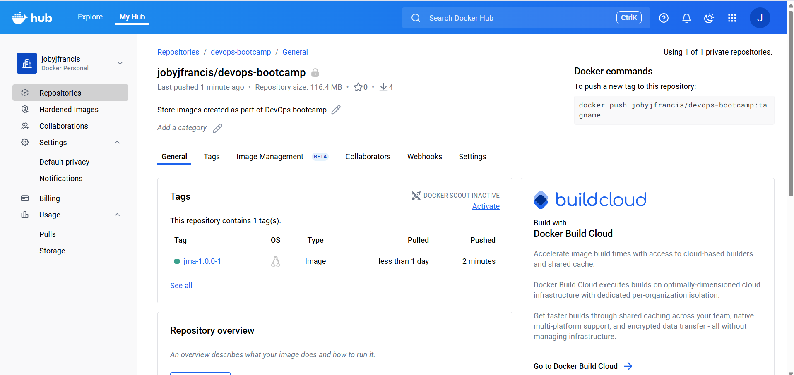
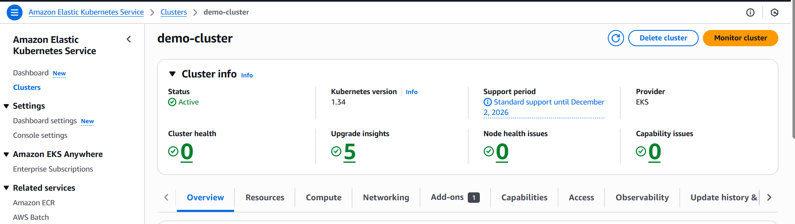
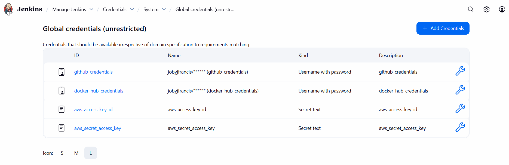
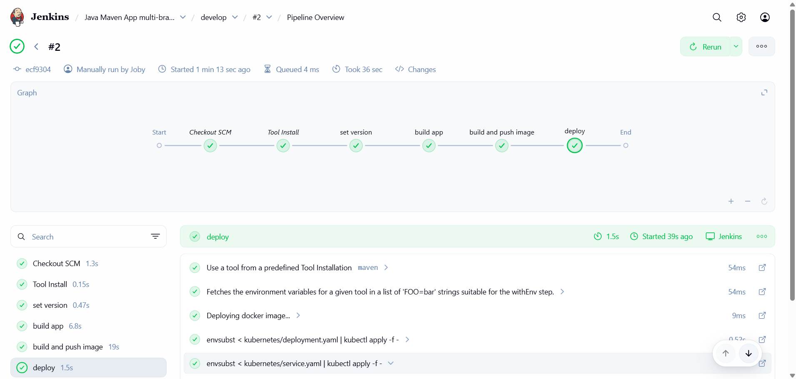
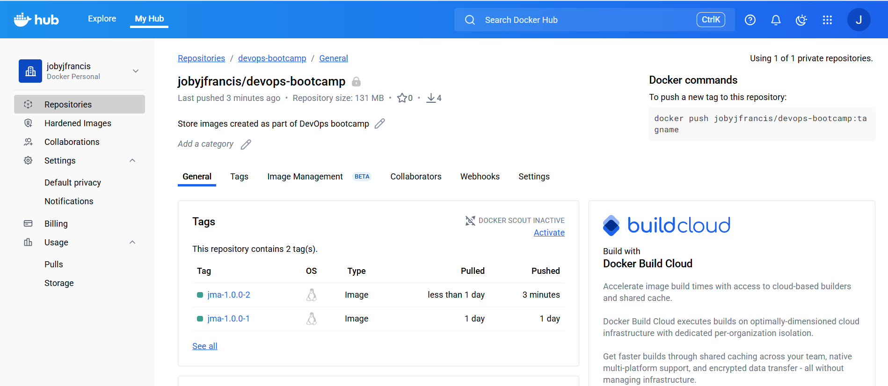

# Project description
Create a CI/CD pipeline for a Java Maven Application to perform the following actions:

* CI: Dynamically set the application version
* CI: Build artifact for Java Maven application - JAR file
* CI: Build and push Docker image to DockerHub
* CD: Deploy new application version to the EKS cluster

# Technologies used
Kubernetes, Jenkins, AWS EKS, Docker Hub, Java, Maven, Linux, Docker, Git, Digital Ocean

# Prerequisite
* Java maven application code available at https://github.com/jobyjfrancis/java-maven-app
* Jenkins shared library https://github.com/jobyjfrancis/jenkins-shared-library

# Steps performed

## Containerise the Java Maven application

1. Created a new branch named `develop` under the Java Maven application repository and configured `Dockerfile` with the appropriate instructions to containerise it - https://github.com/jobyjfrancis/java-maven-app/blob/develop/Dockerfile

2. Tested the application build and docker image creation

```
joby@LAPTOP-KVPR8SO6:~/learn/java-maven-app (develop)$ mvn clean package
[INFO] Scanning for projects...
[INFO]
[INFO] ---------------------< com.example:java-maven-app >---------------------
[INFO] Building java-maven-app 1.0.0
[INFO] --------------------------------[ jar ]---------------------------------
[INFO]
[INFO] --- maven-clean-plugin:2.5:clean (default-clean) @ java-maven-app ---
[INFO]
[INFO] --- maven-resources-plugin:2.6:resources (default-resources) @ java-maven-app ---
[WARNING] Using platform encoding (UTF-8 actually) to copy filtered resources, i.e. build is platform dependent!
[INFO] Copying 1 resource
[INFO]
[INFO] --- maven-compiler-plugin:3.6.0:compile (default-compile) @ java-maven-app ---
[INFO] Changes detected - recompiling the module!
[WARNING] File encoding has not been set, using platform encoding UTF-8, i.e. build is platform dependent!
[INFO] Compiling 1 source file to /home/joby/learn/java-maven-app/target/classes
[INFO]
[INFO] --- maven-resources-plugin:2.6:testResources (default-testResources) @ java-maven-app ---
[WARNING] Using platform encoding (UTF-8 actually) to copy filtered resources, i.e. build is platform dependent!
[INFO] skip non existing resourceDirectory /home/joby/learn/java-maven-app/src/test/resources
[INFO]
[INFO] --- maven-compiler-plugin:3.6.0:testCompile (default-testCompile) @ java-maven-app ---
[INFO] No sources to compile
[INFO]
[INFO] --- maven-surefire-plugin:2.12.4:test (default-test) @ java-maven-app ---
[INFO] No tests to run.
[INFO]
[INFO] --- maven-jar-plugin:2.4:jar (default-jar) @ java-maven-app ---
[INFO] Building jar: /home/joby/learn/java-maven-app/target/java-maven-app-1.0.0.jar
[INFO]
[INFO] --- spring-boot-maven-plugin:2.3.5.RELEASE:repackage (default) @ java-maven-app ---
[INFO] Replacing main artifact with repackaged archive
[INFO] ------------------------------------------------------------------------
[INFO] BUILD SUCCESS
[INFO] ------------------------------------------------------------------------
[INFO] Total time:  2.211 s
[INFO] Finished at: 2025-11-24T18:41:53+13:00
[INFO] ------------------------------------------------------------------------
joby@LAPTOP-KVPR8SO6:~/learn/java-maven-app (develop)$
```
```
joby@LAPTOP-KVPR8SO6:~/learn/java-maven-app (develop)$ ls -al target/*.jar
-rw-r--r-- 1 joby joby 17200345 Nov 24 18:41 target/java-maven-app-1.0.0.jar
joby@LAPTOP-KVPR8SO6:~/learn/java-maven-app (develop)$
```
```
joby@LAPTOP-KVPR8SO6:~/learn/java-maven-app (develop)$ docker build -t jma:1.0.0 .
[+] Building 3.5s (9/9) FINISHED                                                                                                 docker:default
 => [internal] load build definition from Dockerfile                                                                                       0.0s
 => => transferring dockerfile: 187B                                                                                                       0.0s
 => [internal] load metadata for docker.io/library/amazoncorretto:8-alpine3.17-jre                                                         2.8s
 => [auth] library/amazoncorretto:pull token for registry-1.docker.io                                                                      0.0s
 => [internal] load .dockerignore                                                                                                          0.0s
 => => transferring context: 2B                                                                                                            0.0s
 => [internal] load build context                                                                                                          0.0s
 => => transferring context: 81B                                                                                                           0.0s
 => [1/3] FROM docker.io/library/amazoncorretto:8-alpine3.17-jre@sha256:3dbdce03fbe921966033eca64c4f75c949bbe85785ed243e99ed4a335d784bda   0.0s
 => => resolve docker.io/library/amazoncorretto:8-alpine3.17-jre@sha256:3dbdce03fbe921966033eca64c4f75c949bbe85785ed243e99ed4a335d784bda   0.0s
 => CACHED [2/3] COPY ./target/java-maven-app-*.jar /usr/app/                                                                              0.0s
 => CACHED [3/3] WORKDIR /usr/app                                                                                                          0.0s
 => exporting to image                                                                                                                     0.4s
 => => exporting layers                                                                                                                    0.0s
 => => exporting manifest sha256:41d13f94679977c9efe38c867941021d7f0941ac442184f643bcc630c8414796                                          0.0s
 => => exporting config sha256:4d96f2ae3406764290970ef6b142fa5924c30032e620b4cec04f7b41eae1251e                                            0.0s
 => => exporting attestation manifest sha256:10c1071ff2a5474262a6fd2cc147934caa3f9ac1b5baa7cc513c14af7e174f98                              0.0s
 => => exporting manifest list sha256:21dc03bd1ff08f77363056e3276cbfedfa785ceb2af0ff98f4aad8fdfd8f067f                                     0.0s
 => => naming to docker.io/library/jma:1.0.0                                                                                               0.0s
 => => unpacking to docker.io/library/jma:1.0.0                                                                                            0.2s

 1 warning found (use docker --debug to expand):
 - JSONArgsRecommended: JSON arguments recommended for CMD to prevent unintended behavior related to OS signals (line 8)
joby@LAPTOP-KVPR8SO6:~/learn/java-maven-app (develop)$
```
```
joby@LAPTOP-KVPR8SO6:~/learn/java-maven-app (develop)$ docker images | grep jma
jma                                                                      1.0.0           21dc03bd1ff0   13 hours ago    194MB
joby@LAPTOP-KVPR8SO6:~/learn/java-maven-app (develop)$
```
## Continous Integration - CI

This stage involves creating a Jenkins server, configuring the build tools, required credentials and configuring a multi-branch pipeline job that would perform the following CI steps:

* CI: Dynamically set the application version
* CI: Build artifact for Java Maven application - JAR file
* CI: Build and push Docker image to DockerHub

1. Created an Ubuntu 24.04 droplet in Digital Ocean, installed docker and deployed Jenkins as a container in it


```
root@jenkins-server:~# docker version
Client:
 Version:           28.4.0
 API version:       1.51
 Go version:        go1.24.6
 Git commit:        d8eb465
 Built:             Thu Sep 11 16:43:06 2025
 OS/Arch:           linux/amd64
 Context:           default

Server:
 Engine:
  Version:          28.4.0
  API version:      1.51 (minimum version 1.24)
  Go version:       go1.24.6
  Git commit:       249d679
  Built:            Thu Sep 11 16:43:39 2025
  OS/Arch:          linux/amd64
  Experimental:     false
 containerd:
  Version:          v1.7.27
  GitCommit:        05044ec0a9a75232cad458027ca83437aae3f4da
 runc:
  Version:          1.2.6
  GitCommit:
 docker-init:
  Version:          0.19.0
  GitCommit:        de40ad0
root@jenkins-server:~#
```
```
root@jenkins-server:~# docker run -d -p 8080:8080 -v jenkins_home:/var/jenkins_home jenkins/jenkins:lts
Unable to find image 'jenkins/jenkins:lts' locally
lts: Pulling from jenkins/jenkins
13cc39f8244a: Pull complete
dc2a77f462ea: Pull complete
33300af18dd0: Pull complete
c27509c3e53b: Pull complete
e4beac64dffa: Pull complete
a37b858bb47a: Pull complete
744b4792e083: Pull complete
05a7d9a8b608: Pull complete
8d2a75b252b2: Pull complete
65e4ba8066bc: Pull complete
5dc07232677a: Pull complete
7718ff514022: Pull complete
Digest: sha256:7b1c378278279c8688efd6168c25a1c2723a6bd6f0420beb5ccefabee3cc3bb1
Status: Downloaded newer image for jenkins/jenkins:lts
0dc2152277792011d60ed7255febbb956ade7b509b792b067bc741eef8de459a
root@jenkins-server:~#
```
```
root@jenkins-server:~# docker ps
CONTAINER ID   IMAGE                 COMMAND                  CREATED          STATUS          PORTS                                                    NAMES
0dc215227779   jenkins/jenkins:lts   "/usr/bin/tini -- /u…"   47 seconds ago   Up 46 seconds   0.0.0.0:8080->8080/tcp, [::]:8080->8080/tcp, 50000/tcp   determined_hoover
root@jenkins-server:~#
```


2. Added the credentials for Github and Docker Hub so that Jenkins can access them and perform operations such as cloning the code, docker login and docker push image


3. Installed the build tool `maven` for the Java application in Jenkins - this tool is used to build the application that would produce a `JAR` artifact


4. Stopped the Jenkins container, created it again by mounting `/var/run/docker.sock`, corrected permissions of `var/run/docker.sock` and installed `docker` inside the Jenkins container so that our pipeline can use `docker` commands

```
root@jenkins-server:~# docker ps
CONTAINER ID   IMAGE                 COMMAND                  CREATED          STATUS          PORTS                                                    NAMES
0dc215227779   jenkins/jenkins:lts   "/usr/bin/tini -- /u…"   39 minutes ago   Up 39 minutes   0.0.0.0:8080->8080/tcp, [::]:8080->8080/tcp, 50000/tcp   determined_hoover
root@jenkins-server:~#
root@jenkins-server:~# docker stop 0dc215227779
0dc215227779
root@jenkins-server:~#
```
```
root@jenkins-server:~# docker run -d -p 8080:8080 -v jenkins_home:/var/jenkins_home -v /var/run/docker.sock:/var/run/docker.sock jenkins/jenkins
:lts
6af93264dcaa56202081fa37a6906ff0d2eac796ac6889f670113d31102e1a39
root@jenkins-server:~#
```
```
root@jenkins-server:~# docker exec -it -u 0 6af93264dcaa /bin/bash
root@6af93264dcaa:/#
root@6af93264dcaa:/# chmod 666  /var/run/docker.sock
root@6af93264dcaa:/#
root@6af93264dcaa:/# curl https://get.docker.com/ > dockerinstall && chmod 777 dockerinstall && ./dockerinstall
  % Total    % Received % Xferd  Average Speed   Time    Time     Time  Current
                                 Dload  Upload   Total   Spent    Left  Speed
100 21013  100 21013    0     0   690k      0 --:--:-- --:--:-- --:--:--  707k
# Executing docker install script, commit: 7d96bd3c5235ab2121bcb855dd7b3f3f37128ed4
+ sh -c apt-get -qq update >/dev/null
+ sh -c DEBIAN_FRONTEND=noninteractive apt-get -y -qq install ca-certificates curl >/dev/null
+ sh -c install -m 0755 -d /etc/apt/keyrings
+ sh -c curl -fsSL "https://download.docker.com/linux/debian/gpg" -o /etc/apt/keyrings/docker.asc
+ sh -c chmod a+r /etc/apt/keyrings/docker.asc
+ sh -c echo "deb [arch=amd64 signed-by=/etc/apt/keyrings/docker.asc] https://download.docker.com/linux/debian trixie stable" > /etc/apt/sources.list.d/docker.list
+ sh -c apt-get -qq update >/dev/null
+ sh -c DEBIAN_FRONTEND=noninteractive apt-get -y -qq install docker-ce docker-ce-cli containerd.io docker-compose-plugin docker-ce-rootless-extras docker-buildx-plugin docker-model-plugin >/dev/null
+ sh -c docker version
Client: Docker Engine - Community
 Version:           29.0.4
 API version:       1.51 (downgraded from 1.52)
 Go version:        go1.25.4
 Git commit:        3247a5a
 Built:             Mon Nov 24 21:59:48 2025
 OS/Arch:           linux/amd64
 Context:           default

Server:
 Engine:
  Version:          28.4.0
  API version:      1.51 (minimum version 1.24)
  Go version:       go1.24.6
  Git commit:       249d679
  Built:            Thu Sep 11 16:43:39 2025
  OS/Arch:          linux/amd64
  Experimental:     false
 containerd:
  Version:          v1.7.27
  GitCommit:        05044ec0a9a75232cad458027ca83437aae3f4da
 runc:
  Version:          1.2.6
  GitCommit:
 docker-init:
  Version:          0.19.0
  GitCommit:        de40ad0

================================================================================

To run Docker as a non-privileged user, consider setting up the
Docker daemon in rootless mode for your user:

    dockerd-rootless-setuptool.sh install

Visit https://docs.docker.com/go/rootless/ to learn about rootless mode.


To run the Docker daemon as a fully privileged service, but granting non-root
users access, refer to https://docs.docker.com/go/daemon-access/

WARNING: Access to the remote API on a privileged Docker daemon is equivalent
         to root access on the host. Refer to the 'Docker daemon attack surface'
         documentation for details: https://docs.docker.com/go/attack-surface/

================================================================================

root@6af93264dcaa:/#
```
5. Created the `Jenkinsfile` with configuration for CI stages under the application - https://github.com/jobyjfrancis/java-maven-app/blob/develop/Jenkinsfile

6. Created the multi-branch pipeline named `Java Maven App multi-branch pipeline`, configured it with the Git URL and other required parameters.


7. Ran the build and confirmed that the CI stages have worked as configured for `develop` branch


8. Checked `docker hub` and could see that the image has been uploaded



## Continous Deployment - CD

This stage involves creating an EKS cluster where we can deploy the Java Maven application container and associated services. We would create the required AWS credentials in Jenkins server, install `kubectl`, `aws-iam-authenticator` and make `kubeconfig` settings. Finally we would update our multi-branch pipeline - `Jenkinsfile` to implement the CD step:

* CD: Deploy new application version to the EKS cluster

1. Installed `eksctl` in the local machine as per the instructions in https://docs.aws.amazon.com/eks/latest/eksctl/installation.html

```
joby@LAPTOP-KVPR8SO6:~/learn/devops/ci-cd (main)$ eksctl version
0.217.0
joby@LAPTOP-KVPR8SO6:~/learn/devops/ci-cd (main)$
```
2. Created the EKS cluster in AWS using `eksctl` command

```
joby@LAPTOP-KVPR8SO6:~/learn/devops/ci-cd (main)$ eksctl create cluster --name demo-cluster --version 1.34 --region ap-southeast-2 --nodegroup-name demo-nodes --node-type t2.micro --nodes 2 --nodes-min 2 --nodes-max 3
```
# Output
```
2025-12-04 16:43:40 [ℹ]  eksctl version 0.217.0
2025-12-04 16:43:40 [ℹ]  using region ap-southeast-2
2025-12-04 16:43:40 [ℹ]  setting availability zones to [ap-southeast-2a ap-southeast-2b ap-southeast-2c]
2025-12-04 16:43:40 [ℹ]  subnets for ap-southeast-2a - public:192.168.0.0/19 private:192.168.96.0/19
2025-12-04 16:43:40 [ℹ]  subnets for ap-southeast-2b - public:192.168.32.0/19 private:192.168.128.0/19
2025-12-04 16:43:40 [ℹ]  subnets for ap-southeast-2c - public:192.168.64.0/19 private:192.168.160.0/19
2025-12-04 16:43:40 [ℹ]  nodegroup "demo-nodes" will use "" [AmazonLinux2023/1.34]
----------------------------------------------------------------------------------------------------
----------------------------------------------------------------------------------------------------
----------------------------------------------------------------------------------------------------
----------------------------------------------------------------------------------------------------
----------------------------------------------------------------------------------------------------
----------------------------------------------------------------------------------------------------
2025-12-04 16:58:43 [ℹ]  kubectl command should work with "/home/joby/.kube/config", try 'kubectl get nodes'
2025-12-04 16:58:43 [✔]  EKS cluster "demo-cluster" in "ap-southeast-2" region is ready
joby@LAPTOP-KVPR8SO6:~/learn/devops/ci-cd (main)$
```


```
joby@LAPTOP-KVPR8SO6:~/learn/devops/ci-cd (main)$ kubectl cluster-info
Kubernetes control plane is running at https://771FD6BA58D4221EE9BEAD0141E3E3B5.gr7.ap-southeast-2.eks.amazonaws.com
CoreDNS is running at https://771FD6BA58D4221EE9BEAD0141E3E3B5.gr7.ap-southeast-2.eks.amazonaws.com/api/v1/namespaces/kube-system/services/kube-dns:dns/proxy

To further debug and diagnose cluster problems, use 'kubectl cluster-info dump'.
joby@LAPTOP-KVPR8SO6:~/learn/devops/ci-cd (main)$
```
3. Installed `kubectl` and `aws-iam-authenticator` inside the jenkins container so that the jenkins controller can interact with the EKS cluster

```
root@df86b8f0fc59:/# curl -LO "https://dl.k8s.io/release/$(curl -L -s https://dl.k8s.io/release/stable.txt)/bin/linux/amd64/kubectl"; chmod +x ./kubectl; mv ./kubectl /usr/local/bin/kubectl
  % Total    % Received % Xferd  Average Speed   Time    Time     Time  Current
                                 Dload  Upload   Total   Spent    Left  Speed
100   138  100   138    0     0    647      0 --:--:-- --:--:-- --:--:--   650
100 57.7M  100 57.7M    0     0   153M      0 --:--:-- --:--:-- --:--:--  153M
root@df86b8f0fc59:/#
```
```
root@df86b8f0fc59:/# kubectl version
Client Version: v1.34.2
Kustomize Version: v5.7.1
Error from server (Forbidden): <html><head><meta http-equiv='refresh' content='1;url=/login?from=%2Fversion%3Ftimeout%3D32s'/><script id='redirect' data-redirect-url='/login?from=%2Fversion%3Ftimeout%3D32s' src='/static/2ef99cf8/scripts/redirect.js'></script></head><body style='background-color:white; color:white;'>
Authentication required
<!--
-->

</body></html>
root@df86b8f0fc59:/#
```
```
root@df86b8f0fc59:/# curl -Lo aws-iam-authenticator https://github.com/kubernetes-sigs/aws-iam-authenticator/releases/download/v0.6.22/aws-iam-authenticator_0.6.22_linux_amd64
  % Total    % Received % Xferd  Average Speed   Time    Time     Time  Current
                                 Dload  Upload   Total   Spent    Left  Speed
  0     0    0     0    0     0      0      0 --:--:-- --:--:-- --:--:--     0
100 56.1M  100 56.1M    0     0  12.9M      0  0:00:04  0:00:04 --:--:-- 15.5M
root@df86b8f0fc59:/#
```
```
root@df86b8f0fc59:/# chmod +x aws-iam-authenticator
root@df86b8f0fc59:/# mv aws-iam-authenticator /usr/local/bin/
root@df86b8f0fc59:/#
```
```
root@df86b8f0fc59:/# aws-iam-authenticator version
{"Version":"0.6.22","Commit":"af0516881f230fff185217e13ea1874931159fe6"}
root@df86b8f0fc59:/#
```
4. Created the configuration required for `kubeconfig` file in the jenkins-server host by setting `certificate-authority-data`, `server` and `cluster_name`
```
root@jenkins-server:~# cat config
apiVersion: v1
kind: Config
clusters:
- cluster:
    certificate-authority-data: LS0tLS1CRUdJTiBDRVJUSUZJQ0FURS0tLS0tCk1JSURCVENDQWUyZ0F3SUJBZ0lJQmcvWFNMdnpCQUV3RFFZSktvWklodmNOQVFFTEJRQXdGVEVUTUJFR0ExVUUKQXhNS2EzVmlaWEp1WlhSbGN6QWVGdzB5TlRFeU1EUXdNelEwTkRsYUZ3MHpOVEV5TURJd016UTVORGxhTUJVeApFekFSQmdOVkJBTVRDbXQxWW1WeWJtVjBaWE13Z2dFaU1BMEdDU3FHU0liM0RRRUJBUVVBQTRJQkR3QXdnZ0VLCkFvSUJBUUNzWDNIRlFPTDNhYktSVWtOdEJDREVKWW1XdmJHNk1la2tZdWthdHVHSll0aXdmZk0yZGJuczV4dUgKbzBQWWYzRi9xMVFyTUw3TEJJR3UvcFc1ekNMZ2RiQkV5NzIzRy9DSDlHRjNVcmc0R0VSKzBHOEEvdUdOL1ZSRAp3RUpjR2tjL2REck1CSWlZTFdkRjhYR0RlSDh0OVRQUEl4OSsvcjJBYlhOZ3FzeWxZWC9wencwNHllL3djZ0ZLCitvYm42bjVwdnRwWjVsMFpzclJQWjVxZlZRODNVSzJMRWxxaXZ0Y1BmUFQyUW1sVXYzOUx5Z2FPNmFPZnJIMFMKbWlhVFUzVkd3N2JkVFBjNitxSWZtS01xNUtvbHdodDhKNitibC9hOU5rUFZmalg5N0hkSkN3WHB5emxJUkhaago5WEc1UW9kelJ0dm9Ya1RpTjZsV0Exckg2WUtMQWdNQkFBR2pXVEJYTUE0R0ExVWREd0VCL3dRRUF3SUNwREFQCkJnTlZIUk1CQWY4RUJUQURBUUgvTUIwR0ExVWREZ1FXQkJRS0hQR1BncGJ2cFhEZHg4elMwa1BqTmJVNUhUQVYKQmdOVkhSRUVEakFNZ2dwcmRXSmxjbTVsZEdWek1BMEdDU3FHU0liM0RRRUJDd1VBQTRJQkFRQWovY0tsTkhnUQppVVQ2VzNwSTBrU20vZ2lxV042YUJMaktFTEhLbWZvbnB0TmNmTzJBMjdUd1BkQzlxSnNnQ044bGZxZmk1YnpTCjZvYzVCZEdmeHJqNFdQclh1Z0kvaUVaTnJGcVlkTmN0TDVZdllRTXB6MzEwOGRCQXpSZGxwcFdQWTBKTXppM24KSWw0YkgrVGQzSi9ZZ0YraU90eWdWRGRnOU8rVStJUit4SmNEVmVRWFhhQ24wL1hmRTZhUTZGelhld1ZsVDEyZgpaMldOVmV3QnVTNS9QaHJ5bElKWXdTL3kxdVVXL21mUkcyOG9ZcUlmVEJNaEdtZm5YTWIyWmhKRzRONlYxYW51CjdvR281ZnpJbnl5QUZjZTFZamtPT1p5WjVIa1FJLzRWM0R5SjlESm9DcDhYQzhhSWpkT29pS3BHQXBWUjNnMjUKOVBZVHNnRDBUQUZ0Ci0tLS0tRU5EIENFUlRJRklDQVRFLS0tLS0K
    server: https://771FD6BA58D4221EE9BEAD0141E3E3B5.gr7.ap-southeast-2.eks.amazonaws.com
  name: kubernetes
contexts:
- context:
    cluster: kubernetes
    user: aws
  name: aws
current-context: aws
users:
- name: aws
  user:
    exec:
      apiVersion: client.authentication.k8s.io/v1beta1
      command: /usr/local/bin/aws-iam-authenticator
      args:
        - "token"
        - "-i"
        - "demo-cluster"
root@jenkins-server:~#
```
5. Created the folder `.kube` inside the container at jenkins home directory `/var/jenkins_home`. Moved the `config` file from `jenkins-server` host to the jenkins container at `/var/jenkins_home/.kube`

```
root@jenkins-server:~# docker exec -it df86b8f0fc59 /bin/bash
jenkins@df86b8f0fc59:/$
jenkins@df86b8f0fc59:/$
jenkins@df86b8f0fc59:/$ pwd
/
jenkins@df86b8f0fc59:/$ cd ~
jenkins@df86b8f0fc59:~$
jenkins@df86b8f0fc59:~$
jenkins@df86b8f0fc59:~$ pwd
/var/jenkins_home
jenkins@df86b8f0fc59:~$ mkdir .kube
jenkins@df86b8f0fc59:~$
jenkins@df86b8f0fc59:~$ exit
exit
root@jenkins-server:~#
```
```
root@jenkins-server:~# docker cp config df86b8f0fc59:/var/jenkins_home/.kube/
Successfully copied 3.58kB to df86b8f0fc59:/var/jenkins_home/.kube/
root@jenkins-server:~#
```
```
jenkins@df86b8f0fc59:/$ ls -al ~/.kube/config
-rw-r--r-- 1 root root 1973 Dec  4 04:06 /var/jenkins_home/.kube/config
jenkins@df86b8f0fc59:/$
```
6. Also added the AWS `access key ID` and `secret access key` in Jenkins to authenticate with AWS



7. Installed `gettext-base` package in the Jenkins container to get `envsubst` tool/command. This would later be used in the `Jenkinsfile` to pass the `APP_NAME` and `IMAGE_NAME` to kubernetes manifest files

```
root@df86b8f0fc59:/# apt install gettext-base
Installing:
  gettext-base

Summary:
  Upgrading: 0, Installing: 1, Removing: 0, Not Upgrading: 4
  Download size: 243 kB
  Space needed: 758 kB / 77.7 GB available

Get:1 http://deb.debian.org/debian trixie/main amd64 gettext-base amd64 0.23.1-2 [243 kB]
Fetched 243 kB in 0s (7836 kB/s)
debconf: unable to initialize frontend: Dialog
debconf: (No usable dialog-like program is installed, so the dialog based frontend cannot be used. at /usr/share/perl5/Debconf/FrontEnd/Dialog.pm line 79, <STDIN> line 1.)
debconf: falling back to frontend: Readline
Selecting previously unselected package gettext-base.
(Reading database ... 12542 files and directories currently installed.)
Preparing to unpack .../gettext-base_0.23.1-2_amd64.deb ...
Unpacking gettext-base (0.23.1-2) ...
Setting up gettext-base (0.23.1-2) ...
root@df86b8f0fc59:/#
```
```
root@df86b8f0fc59:/# envsubst -V
envsubst (GNU gettext-runtime) 0.23.1
Copyright (C) 2003-2024 Free Software Foundation, Inc.
License GPLv3+: GNU GPL version 3 or later <https://gnu.org/licenses/gpl.html>
This is free software: you are free to change and redistribute it.
There is NO WARRANTY, to the extent permitted by law.
Written by Bruno Haible.
root@df86b8f0fc59:/#
```
8. Created a `docker-registry` secret in the EKS cluster for Kubernetes to use so that it can fetch the application image from `Docker Hub` - this command was performef from my local machine

```
joby@LAPTOP-KVPR8SO6:~/learn/devops/ci-cd (main)$ kubectl create secret docker-registry my-docker-registry-key --docker-server=docker.io --docker-username=jobyjfrancis --docker-password=********************
secret/my-docker-registry-key created
joby@LAPTOP-KVPR8SO6:~/learn/devops/ci-cd (main)$
```
```
joby@LAPTOP-KVPR8SO6:~/learn/devops/ci-cd (main)$ kubectl get secret
NAME                     TYPE                             DATA   AGE
my-docker-registry-key   kubernetes.io/dockerconfigjson   1      2m15s
joby@LAPTOP-KVPR8SO6:~/learn/devops/ci-cd (main)$
```
9. In the Java Maven application repository https://github.com/jobyjfrancis/java-maven-app under `develop` branch, created the folder `kubernetes` and confgured the `deployment.yaml` and `service.yaml` files. Also added the `deploy` stage in `Jenkinsfile`

https://github.com/jobyjfrancis/java-maven-app/tree/develop/kubernetes
https://github.com/jobyjfrancis/java-maven-app/blob/develop/Jenkinsfile

10. Manually ran the multi-branch pipeline build for `develop` branch and it has successfully run all the stages in CI/CD





11. Checked the EKS cluster and could confirm that the application has been deployed

```
joby@LAPTOP-KVPR8SO6:~/learn/java-maven-app (develop)$ kubectl get all
NAME                                  READY   STATUS    RESTARTS   AGE
pod/java-maven-app-68d778b97f-9ztxl   0/1     Pending   0          4m46s
pod/java-maven-app-68d778b97f-v6pk6   0/1     Pending   0          4m46s

NAME                     TYPE        CLUSTER-IP       EXTERNAL-IP   PORT(S)   AGE
service/java-maven-app   ClusterIP   10.100.201.174   <none>        80/TCP    4m45s
service/kubernetes       ClusterIP   10.100.0.1       <none>        443/TCP   88m

NAME                             READY   UP-TO-DATE   AVAILABLE   AGE
deployment.apps/java-maven-app   0/2     2            0           4m46s

NAME                                        DESIRED   CURRENT   READY   AGE
replicaset.apps/java-maven-app-68d778b97f   2         2         0       4m46s
joby@LAPTOP-KVPR8SO6:~/learn/java-maven-app (develop)$
```

 
